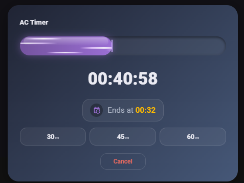
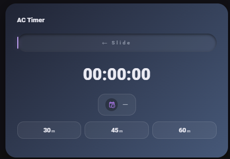
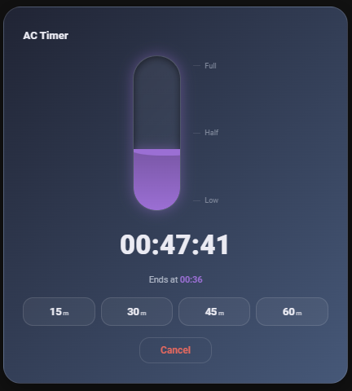

# AC Timer For HA ⏱️

A premium, drag-to-set **countdown timer card** for [Home Assistant](https://www.home-assistant.io/). Built originally to switch an air-conditioner off after a custom amount of time — but it works for **anything**: lights, a boiler, a fan, a pump, or any script/scene/automation you want to run later.

Instead of fixed 30 / 45 / 60-minute buttons, you just **drag the bar to any duration** and release — and your action runs exactly then.

<p align="center">
  
  &nbsp;
  
</p>
<p align="center">
  
</p>

---

- **Shared** — everyone looking at the dashboard sees the exact same live countdown.
- **Reliable** — it keeps running even when the app is closed or the phone is locked.
- **Generic** — the card only starts/stops the timer and shows it; *what happens at the end* is a script / scene / automation you choose.


---

## Features

- 🎚️ **Drag to set any time**, then release to start. Tap a favorite chip for one-touch start.
- 🧩 **4 designs** — Horizontal bar, Vertical liquid, Radial dial, Minimal stepper.
- ✨ **Ambient animations** on the fill — Flowing air (AC running), Bubbles, Aurora, Particles, Frost.
- 🎨 **Full color control** — every part is themeable from the visual editor (no YAML needed).
- ⏲️ **Non-linear scale** — make short times take up more of the bar on a wide range (e.g. 0–240 min), so the animation stays meaningful while 3–4 h compress at the end.
- ⭐ **Your own favorite times** — type any minutes; they appear as quick-start chips.
- 🕒 **Custom "Ends at"** — your own label, icon, colors, size, and full **Hebrew / RTL** support.
- 👆 **7 handle styles**, an idle **"Slide" hint** with selectable effect & speed, warning/danger colors near the end, and reduced-motion support.
- ⏱️ **No percentages, ever** — only time left, end time, and a short status.

---

## Installation

### Via HACS (recommended)

1. **HACS → ⋮ → Custom repositories** → add `https://github.com/lididx/AC-Timer-For-HA`, category **Lovelace**.
2. Search **AC Timer For HA** → **Download**.
3. Hard-refresh the browser (`Ctrl+Shift+R`).

> HACS adds the dashboard resource automatically. If not, add it under *Settings → Dashboards → ⋮ → Resources*: URL `/hacsfiles/AC-Timer-For-HA/ac-timer-card.js`, type **JavaScript Module**.

### Set up

1. Create a **Timer** helper: *Settings → Devices & Services → Helpers → Create Helper → Timer* (e.g. `timer.ac_off`).
2. Edit your dashboard → **Add Card → AC Timer Card**.
3. In the editor, set the **Timer entity**, pick **Run on finish** (your off script / scene / automation), and tweak the look.

---

## Configuration

Everything is editable from the **visual editor** — these are the essentials in YAML:

```yaml
type: custom:ac-timer-card
timer_entity: timer.ac_off
finish_entity: script.ac_turn_off
design: bar          # bar | vertical | dial | stepper
style: air           # none | bubbles | air | aurora | particles | frost
scale: short         # even | short | strong
max_minutes: 240
title: AC Shutoff Timer
presets: [15, 30, 45, 60]
```

| Section | What you can set |
|---|---|
| **Essentials** | timer entity, design, style, action on finish |
| **Appearance** | title, label, direction (RTL/LTR), handle style, slide hint (text/effect/speed), "Ends at" (text/icon/size/width) |
| **Timing** | max / min minutes, step, scale curve |
| **Favorite times** | your quick-start chips + their colors |
| **Colors** | accent, card gradient, text, track, warning, danger, and more |
| **Advanced** | custom finish action in YAML |

---

## Credit

Created by **Lidor Nahum**.
